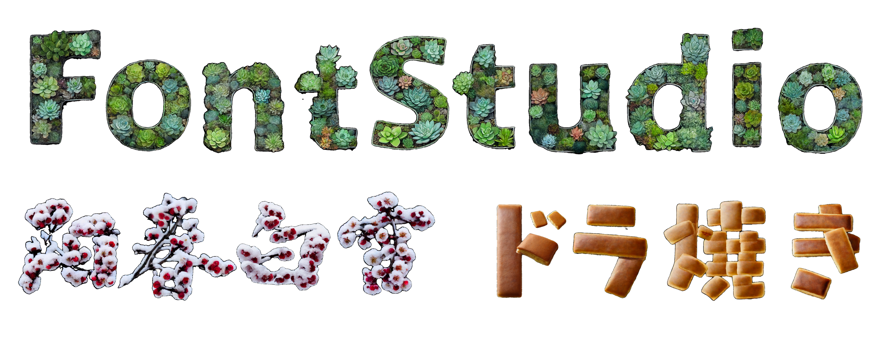
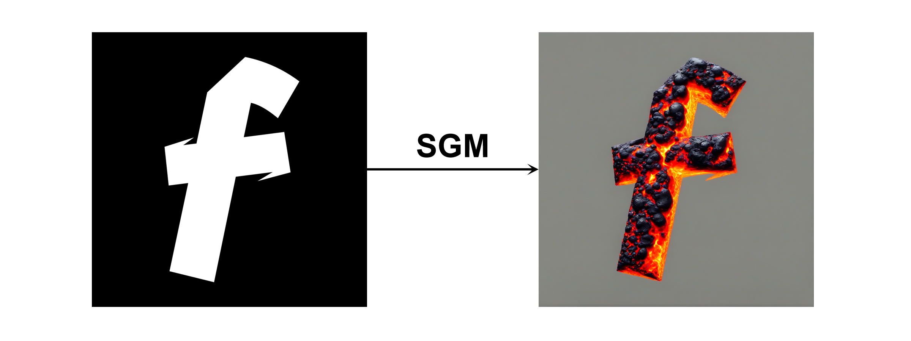
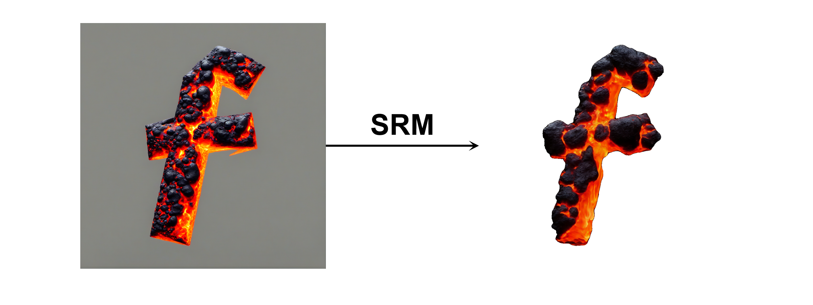

# Reproduction of : FontStudio

[Original Paper (arXiv)](https://arxiv.org/abs/2406.08392)

This project reproduces the paper "FontStudio: Shape-Adaptive Diffusion Model for Coherent and Consistent Font Effect Generation". The paper proposes a method to generate artistic fonts with a consistent style and natural, shape-adaptive effects.

## requirements
```
diffusers==0.34.0
numpy==2.2.6
Pillow==11.2.1
torch==2.6.0
torchvision==0.21.0
transformers==4.53.0
```
## Usage:

### Installation
```
git clone https://github.com/XinMyo/FontStudio.git
cd fontstudio
pip install -r requirements.txt
```
### Shape-adaptive Generation Model (SGM)
First, use SGM to generate the prior image required by SRM.

To function properly, SGM requires a ControlNet model that takes a binary mask as input condition. 

- Test the model
```
python test_SGM.py --prompt "lava" --font_root font_sample/FontStudio --save_root test/FontStudio --controlnet_path "your/path/to/controlnet-model"
```
Download our fine-tuned ControlNet model [here](https://drive.google.com/file/d/1la23MoGbQj1ejWR6LUy9ZK65uTa9m07C/view?usp=sharing) or use your own weights.

- Model initialization
```
from SGM.SGMpipeline import StableDiffusionXLControlNetPipeline
from diffusers import ControlNetModel, AutoencoderKL

controlnet = ControlNetModel.from_pretrained(
    controlnet_path,
    use_safetensors=True,
    torch_dtype=torch.float16,
)
vae = AutoencoderKL.from_pretrained(vae_path, torch_dtype=torch.float16)
pipe = StableDiffusionXLControlNetPipeline.from_pretrained(
    base_model_path,
    controlnet=controlnet,
    vae=vae,
    variant="fp16",
    use_safetensors=True,
    torch_dtype=torch.float16,
)
pipe.enable_model_cpu_offload()
```

- Generating prior image
```
prior = pipe(
	prompt,
	image=cond_img,
	num_inference_steps=30,
	controlnet_conditioning_scale=controlnet_conditioning_scale,
	width=1024,
	height=1024,
	ref_image=ref_image,      #Reference mask
	ref_font=ref_font,      #Reference font image
	SAET_steps=30,
	cross_attention_kwargs = cross_attention_kwargs = {"ma_mask":ToTensor()(cond_img.convert('L')), "ref_mask":ToTensor()(ref_image.convert('L')) }
).images
```
If there is no reference image, just set the parameters with the `ref_` prefix to `None`.

### Shape-adaptive Refinement Model (SRM)
Then use SRM to transform the prior image into the final font image.

- Test the model
```
python test_SRM.py --prompt "lava" --font_root font_sample/FontStudio --save_root test/FontStudio --svd_path "your/path/to/svd-model"
```
Download our SVD model [here](https://drive.google.com/file/d/1FOf_HEQ7Sx5UCkDQX0SmvlzFjLWf5X7r/view?usp=sharing) or use your own weights.

- Model initialization
```
from SRM.SRM_SAET import SRM_SAET
from SRM.SRMpipeline import StableDiffusionXLPipeline
from SRM.SVD import SVDAutoencoderKL

svd = SVDAutoencoderKL.from_pretrained(svd_path, torch_dtype=torch.float16).to("cuda")
sd_pipe = StableDiffusionXLPipeline.from_pretrained(
    sd_path,
    torch_dtype=torch.float16,
    variant="fp16",
    vae=svd,
).to("cuda")

SRM = SRM_SAET(pipe=sd_pipe, vae=svd)
```
- Generating font image
```
result_img = SRM(
	prompt=prompt,
	image=prior,
	num_inference_steps=30,
	noise_strength = 0.8,
	mask=svd_mask,
	ref_image=ref_image,
	SAET_steps=24
)
```
If there is no reference image, just set the parameters with the `ref_` prefix to `None`

# Citation
If you use this code for your research, please cite the original paper:
```
@inproceedings{mu2024fontstudio,
  title={Fontstudio: shape-adaptive diffusion model for coherent and consistent font effect generation},
  author={Mu, Xinzhi and Chen, Li and Chen, Bohan and Gu, Shuyang and Bao, Jianmin and Chen, Dong and Li, Ji and Yuan, Yuhui},
  booktitle={European Conference on Computer Vision},
  pages={305--322},
  year={2024},
  organization={Springer}
}
```
